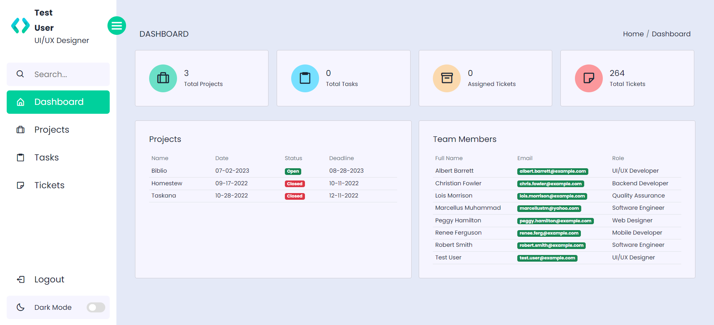
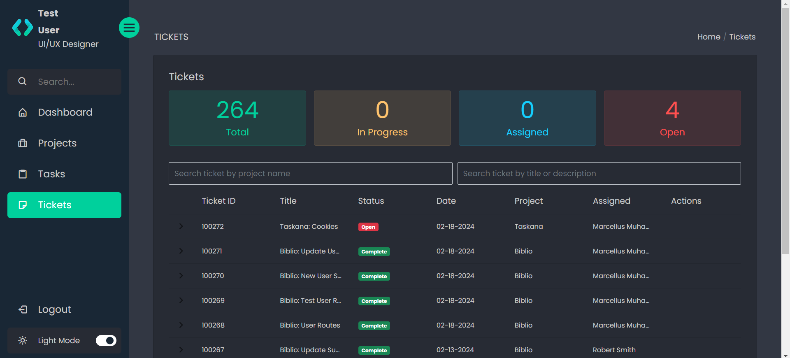

# Taskana Project Management

## Table of contents

- [Overview](#overview)
  - [Installation](#installation)
  - [Authentication](#authentication)
  - [Screenshot](#screenshot)
  - [Built with](#built-with)

### Overview

Taskana is a project management application to assist teams with assignments. Only admin users may create new users or projects, while all other users can edit tickets they are assigned, or tasks they have created. Includes light/dark mode and is fully responsive.

### Installation

To clone down this repository, you will need `node` and `npm` installed globally on your machine.  

Installation:

`npm install`  

To Run Test Suite:  

`npm test`  

To Start Server:

`npm start`

To Visit App:

`localhost:3000`

### Authentication

If you would like to demo the application as a test user:
  email: <test.user@example.com>
  password: Testuser1!

### Screenshot

### Built with

- [React](https://reactjs.org/) - JS library
- [React Router](https://reactrouter.com/en/main) - React page routing
- [Bootstrap](https://getbootstrap.com/) - CSS framework
- [Sass](https://sass-lang.com/) - CSS Extension
